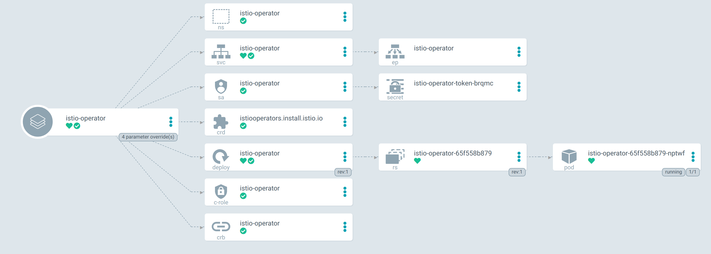
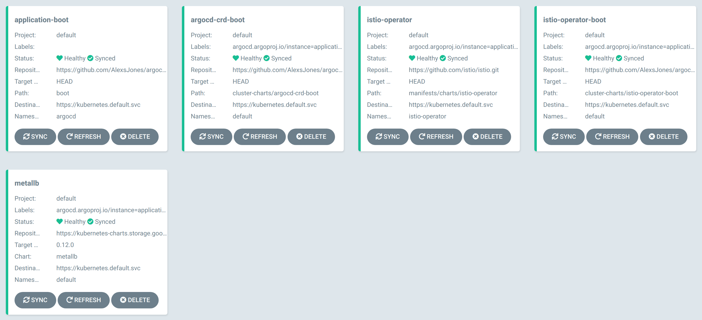

# argocd-istio-bootstrap

 Uses Argocd app-of-apps to deploy Istio service mesh and the necessary dependencies.

- Run `./init.sh`
- Proxy into Argocd U:admin P:password
- Launch the `application-boot`

